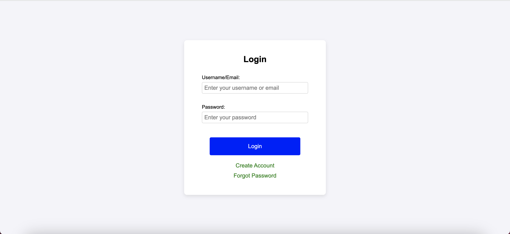
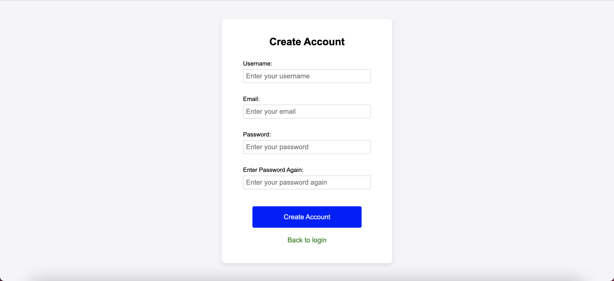
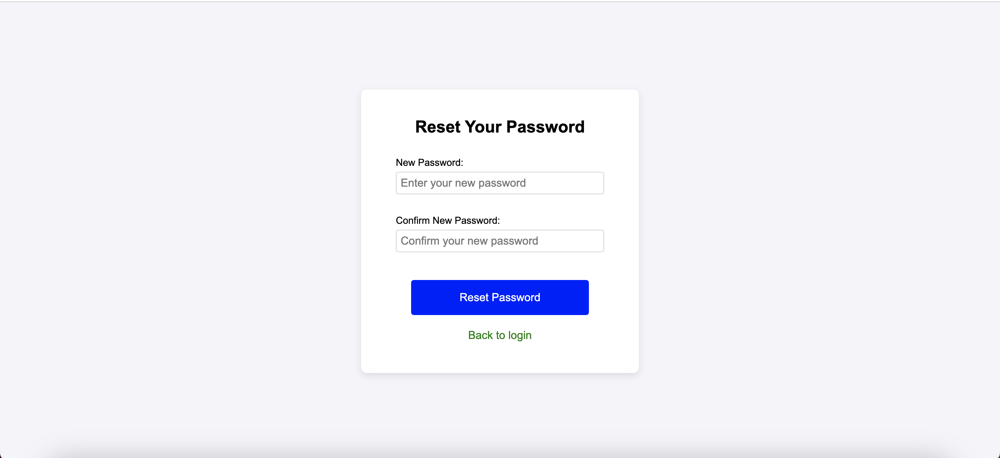
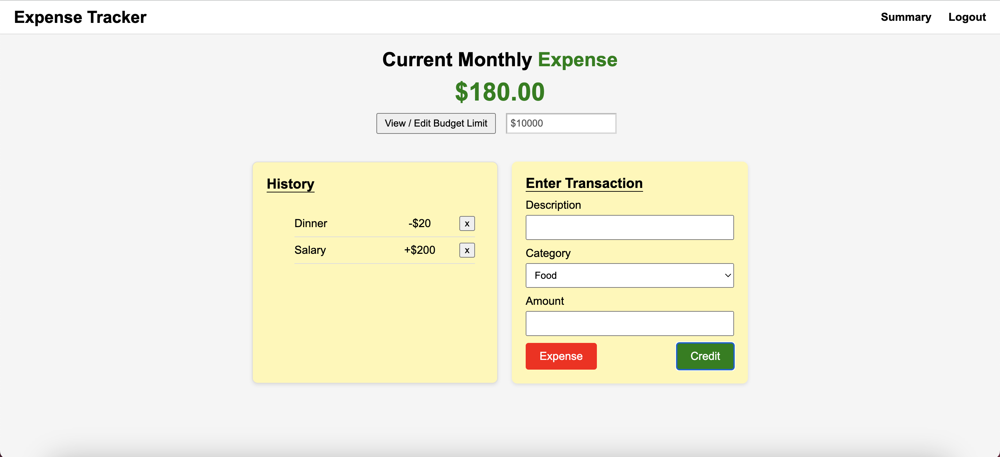
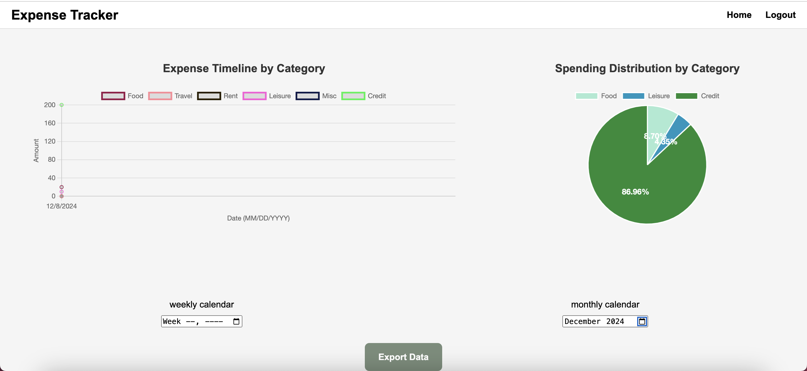

# cse210-fa24-group1

[](https://app.codacy.com?utm_source=gh&utm_medium=referral&utm_content=&utm_campaign=Badge_grade)

# Expense Tracker
Welcome to the Group 1 - Agile Avengers project! For our project, we decided to build an intuitive and user-friendly expense tracker application that allows users to moniter, analyze, and control their expenses and budget. This app aims to promote better financial habits by offering personalized insights into their expenses, monthly and weekly reports, and ultimately helping users make informed financial decisions.

This project was built on top of the following existing codebase: [Expense_Tracker_VanillaJS](https://github.com/MidhaTahir/Expense_Tracker_VanillaJS/tree/master).

# Overview
Our project mainly contains 3 groups of pages: user authentication pages (login/create user/forget password), the home page where the user can see and edit their current expenses, and the summary visualizations page where the user can see a more detailed expense history in graphical form.

This project mainly uses JS, HTML, and CSS for styling. Intergration and unit tests are done with Jest. Our backend database that holds user information and their transactional history is implemented with SQLite.

## User Authentication
When the user first opens our application, they are greeted with the login page as shown below:


If the user has an account, they can input their email/username and password to be taken to the home page. If not, they can click on the "Create Account" link, where they can input their information to create their new account:

The user inputs their own email, username, and password (twice!) to be added to our user database.

If the user has forgotten their password, they can click on the "Forgot Password" link to be taken to the forgot password page:

The user can input either their email or username so that an email is sent to them with a link to another page for them to reset their password:


## Home Page
Once the user has logged in, they see our main home page:


In the home page, the user can see and/or edit their current monthly expense at the top. The "History" subsection is for the user to see their most recent transactions. The "Enter Transaction" subsection is for the user to input their latest transaction. They input a description of the transaction, what category it falls under, and the amount. Then, clicking on "Expense" will subtract that amount from the current monthly expense, while clicking on "Credit" will add the amount. Either way, this transaction will be added to the user's transactional history, meaning that the user will be able to see this history in both the "History" subsection to the left, and the visualizations page.

In the header, clicking "Summary" will take the user to the visualization page, where they can see a more detailed summary of their expense history in the form of graphs. Clicking on "Logout" will log the user out and they are taken back to the login page.

## Visualizations
Clicking on the "Summary" link in the header from the home page will take the user to the visualization page:



There are two main graphs in the summary visualizations page: the line graph and the pie chart. The line graph is mainly concerned with showing the user's transactional history over a period of time. Each line represents its own category. Meanwhile, the pie chart is concerned with showing the percentage spending on each category of the user's transactional history. It showcases how much of the total user expense went into which category.

Below the graphs, we have two calenders: one weekly calender and one monthly. By selecting a week in the weekly calender, or a month in the monely calender, the user can see a visualized breakdown of their expenses for that selected period of time. In other words, the two graphs above (the line chart and pie chart) will change to reflect the data in the given time period. For instance in the second visualization page photo above, we selected the month "December 2024". We see that both the line chart and pie chart reflect the user's transactional history for the month of December 2024. If the user doesn't select a month or week, we display the entire transactional history, like shown in the first photo above.

Lastly, below everything, there is an "Export" button. This button will export the currently displayed data to the user via email. If the user had clicked on "December 2024" through the monthly calender and then clicked the "Export" button, they will receive an email containing data of their expense history from the month December 2024. If no time period was selected, they will get the whole history data.

In the header, clicking "Home" will take the user back to the home page. Clicking on "Logout" will log the user out and they are taken back to the login page.

# How to Contribute to the Expense Tracker Repository

We appreciate your interest in contributing to the Expense Tracker project! By following these steps, you can help improve and enhance the repository.

## Steps to Contribute

### 1. **Clone the Repository**

- Since you're a part of the repository, clone the repository to your local machine directly:
  ```bash
  git clone https://github.com/your-username/cse210-fa24-group1.git
  ```
- Replace `your-username` with your GitHub username.

### 2. **Fetch and Pull Latest Changes**

- After cloning, navigate to the project directory:
  ```bash
  cd cse210-fa24-group1
  ```
- **Fetch the latest changes** from the repository:
  ```bash
  git fetch origin
  ```
- **Pull the latest changes** from the `main` branch (or `master` if that’s the default branch) into your local repository:
  ```bash
  git pull origin main
  ```
  This ensures that your local copy is up-to-date with the remote repository before creating a new branch.

### 3. **Create a New Branch**

- It's best practice to create a new branch for your changes. You can do this by running:
  ```bash
  git checkout -b add/feature-name
  ```
  or,
  ```bash
  git checkout -b bugfix/feature-name
  ```
- Replace `feature-name` with a descriptive name for the feature you are working on.

### 4. **Make Your Changes**

- Navigate to the appropriate file(s) and make your changes.
- Be sure to write clear and concise commit messages that explain the purpose of the changes you’ve made.
- **Commit message format**: Your commit message should include the tag to the current version of the project, e.g., `v1.2.0`, at the beginning of the message. For example:
  ```bash
  git commit -m "v1.2.0 - Add user authentication feature"
  ```

### 5. **Commit Your Changes**

- After making changes, commit them:
  ```bash
  git add .
  git commit -m "v1.2.0 - Add feature for expense categories"
  ```

### 6. **Push Your Changes**

- Push your changes to your branch in the repository:
  ```bash
  git push origin feature-name
  ```

### 7. **Create a Pull Request (PR)**

- Go to the original repository on GitHub and click on the **New Pull Request** button.
- Select your branch with the changes and the base branch (usually `main` or `master`) of the original repository.
- **Edit the Pull Request Template**: Once the pull request template appears, make sure to fill it out with relevant details about your changes, including:
  - A brief description of the changes you made.
  - Any relevant issue numbers or links (if applicable).
  - Testing details, if you added new functionality or fixed a bug.
- Provide a detailed description of your changes and why they are beneficial to the project.

### 8. **Address Feedback**

- If the maintainers request changes or provide feedback, make the necessary updates to your branch.
- After addressing the feedback, commit and push the changes again. Your pull request will automatically update.

### 9. **Celebrate!**

- Once your pull request is reviewed and merged, your contribution is officially part of the repository. Thank you for helping improve the Expense Tracker project!

## Contribution Guidelines

- **Code Style**: Follow the existing [code style](./admin/code-practices.md) in the repository. Pay attention to indentation, naming conventions, and spacing.
- **Testing**: Please ensure that your changes do not break the existing code. If you add new features, include tests to validate your changes.
- **Issue Reporting**: If you encounter any bugs or have suggestions for new features, feel free to open an issue in the repository.

## Code of Conduct

We expect all contributors to adhere to our Code of Conduct and to be respectful and professional when engaging with others in the community.
