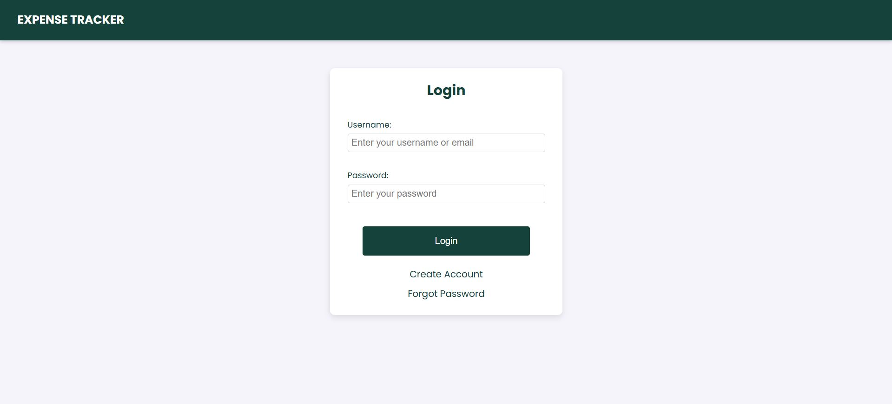
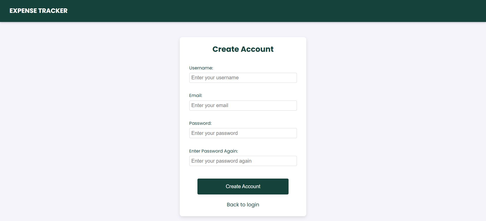
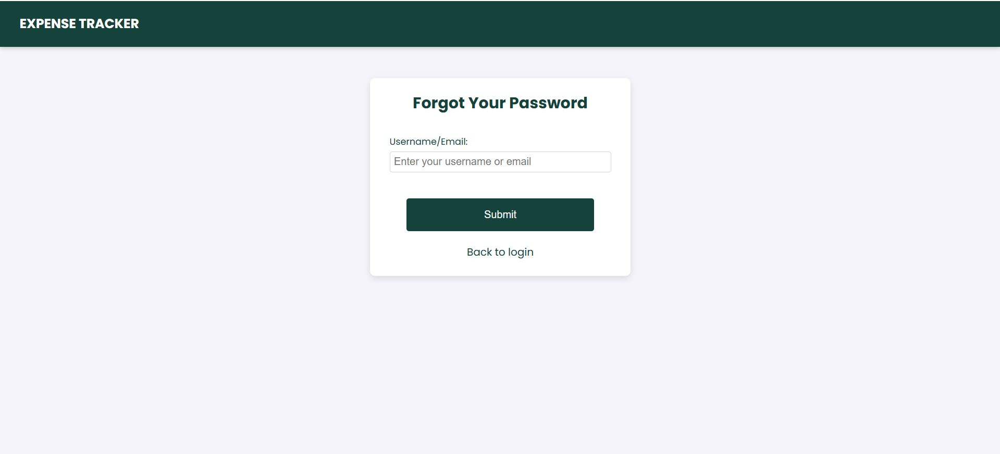
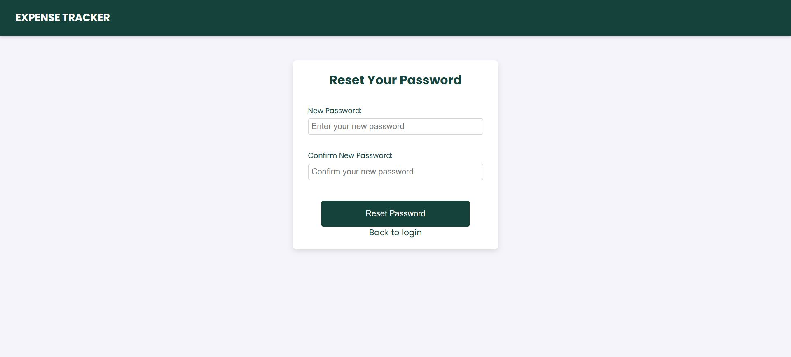
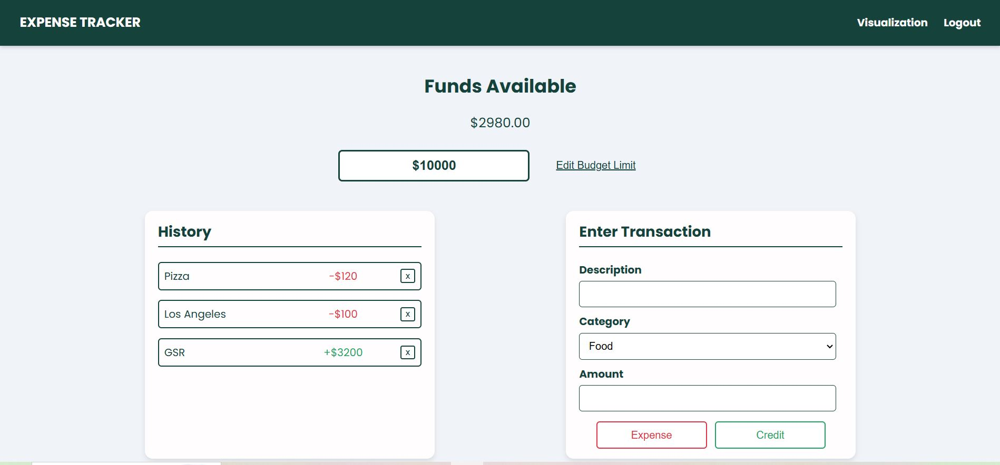

# cse210-fa24-group1

[](https://app.codacy.com?utm_source=gh&utm_medium=referral&utm_content=&utm_campaign=Badge_grade)

[](https://app.codacy.com/gh/cse210-fa24-group1/cse210-fa24-group1/dashboard?utm_source=gh&utm_medium=referral&utm_content=&utm_campaign=Badge_coverage)

# [Expense Tracker](https://aquamarine-concha-0f81d5.netlify.app/)

Welcome to the Group 1 — Agile Avengers project! For our project, we decided to build an intuitive and user-friendly expense tracker application that allows users to monitor, analyze, and control their expenses and budget. This app aims to promote better financial habits by offering personalized insights into their expenses, visualized reports, and ultimately helping users make informed financial decisions.

Check out our hosted link to explore and use our website effortlessly! [Link](https://aquamarine-concha-0f81d5.netlify.app/)

This project was built on top of the following existing codebase: [Expense_Tracker_VanillaJS](https://github.com/MidhaTahir/Expense_Tracker_VanillaJS/tree/master)

To see our JSDocs, click on the link here: [JS Docs](https://cse210-fa24-group1.github.io/cse210-fa24-group1/)

# Overview

Our project mainly contains 3 groups of pages: user authentication pages (login/create user/forget password), the home page where the user can see and edit their current expenses, and the summary visualizations page where the user can see a more detailed expense history in graphical form.

This project mainly uses JS, HTML, and CSS for styling. Integration and unit tests are done with Jest. Our backend database, which holds user information and their transactional history, is implemented with SQLite.

## User Authentication

When the user first opens our application, they are greeted with the login page as shown below:


If the user has an account, they can input their email/username and password to be taken to the home page. If not, they can click on the "Create Account" link, where they can input their information to create their new account:

The user inputs their email, username, and password (twice!) to be added to our user database.

If the user has forgotten their password, they can click on the "Forgot Password" link to be taken to the forgot password page:

The user can input either their email or username so that an email is sent to them with a link to another page for them to reset their password:


## Home Page

Once the user has logged in, they see our main home page:


Users can see and edit their current monthly expenses on the home page at the top. The "History" subsection lets users see their most recent transactions. The "Enter Transaction" subsection allows users to input their latest transactions. They input a transaction description, what category it falls under, and the amount. Then, clicking on "Expense" will subtract that amount from the current monthly expense, while clicking "Credit" will add the amount. Either way, this transaction will be added to the user's transactional history, meaning that the user can see this history in both the "History" subsection to the left and the visualizations page.

In the header, clicking "Visualizations" will take the user to the visualization page, where they can see a more detailed summary of their expense history in graphs. Clicking on "Logout" will log the user out, and they will be taken back to the login page.

## Visualizations

Clicking on the "Visualizations" link in the header from the home page will take the user to the visualization page:


The visualizations page has two main graphs: the line graph and the pie chart. The line graph shows the user's transactional history over a period of time. Each line represents its own category. Meanwhile, the pie chart shows the percentage of spending on each category of the user's transactional history. It showcases how much of the total user expense went into which category.

Above the two graphs, we have two calendars: one start date and one end date. By selecting dates in both calendars, the user can see a visualized breakdown of their expenses for that specified period of time. In other words, the two graphs above (the line and pie charts) will change to reflect the data in the given time period. We display the current month's transactional history if the user doesn't select a start or end date. Users can also click on the categories in the legend to filter them out of the graphs.

Lastly, below everything, there is an "Export" button. This button will download the currently displayed data to the user as a CSV file. If the user has selected dates for the start date and end date, and then clicks the "Export" button, they will download a CSV file containing their expense history from that time. They will get the current month's data if no time period is selected.

Clicking "Home" in the header will take the user back to the home page. Clicking on "Logout" will log the user out, and they will be taken back to the login page.

# How to Contribute to the Expense Tracker Repository

We appreciate your interest in contributing to the Expense Tracker project! By following these steps, you can help improve and enhance the repository.

## Steps to Contribute

### 1. **Clone the Repository**

- Since you're a part of the repository, clone the repository to your local machine directly:
 ```bash
 git clone https://github.com/your-username/cse210-fa24-group1.git
 ```
- Replace `your-username` with your GitHub username.

### 2. **Fetch and Pull Latest Changes**

- After cloning, navigate to the project directory:
 ```bash
 cd cse210-fa24-group1
 ```
- **Fetch the latest changes** from the repository:
 ```bash
 git fetch origin
 ```
- **Pull the latest changes** from the `main` branch (or `master` if that’s the default branch) into your local repository:
 ```bash
 git pull origin main
 ```
 This ensures that your local copy is up-to-date with the remote repository before creating a new branch.

### 3. **Create a New Branch**

- It's best practice to create a new branch for your changes. You can do this by running:
 ```bash
 git checkout -b add/feature-name
 ```
 or,
 ```bash
 git checkout -b bugfix/feature-name
 ```
- Replace `feature-name` with a descriptive name for the feature you are working on.

### 4. **Make Your Changes**

- Navigate to the appropriate file(s) and make your changes.
- Be sure to write clear and concise commit messages that explain the purpose of the changes you’ve made.
- **Commit message format**: Your commit message should include the tag to the current version of the project, e.g., `v1.2.0`, at the beginning of the message. For example:
 ```bash
 git commit -m "v1.2.0 - Add user authentication feature"
 ```

### 5. **Commit Your Changes**

- After making changes, commit them:
 ```bash
 git add .
 git commit -m "v1.2.0 - Add feature for expense categories"
 ```

### 6. **Push Your Changes**

- Push your changes to your branch in the repository:
 ```bash
 git push origin feature-name
 ```

### 7. **Create a Pull Request (PR)**

- Go to the original repository on GitHub and click on the **New Pull Request** button.
- Select your branch with the changes and the base branch (usually `main` or `master`) of the original repository.
- **Edit the Pull Request Template**: Once the pull request template appears, make sure to fill it out with relevant details about your changes, including:
 - A brief description of the changes you made.
 - Any relevant issue numbers or links (if applicable).
 - Testing details, if you added new functionality or fixed a bug.
- Provide a detailed description of your changes and why they are beneficial to the project.

### 8. **Address Feedback**

- If the maintainers request changes or provide feedback, make the necessary updates to your branch.
- After addressing the feedback, commit and push the changes again. Your pull request will automatically update.

### 9. **Celebrate!**

- Once your pull request is reviewed and merged, your contribution is officially part of the repository. Thank you for helping improve the Expense Tracker project!

## Contribution Guidelines

- **Code Style**: Follow the existing [code style](./admin/code-practices.md) in the repository. Pay attention to indentation, naming conventions, and spacing.
- **Testing**: Please ensure that your changes do not break the existing code. If you add new features, include tests to validate your changes.
- **Issue Reporting**: If you encounter any bugs or have suggestions for new features, feel free to open an issue in the repository.

## Code of Conduct

We expect all contributors to adhere to our Code of Conduct and to be respectful and professional when engaging with others in the community.
